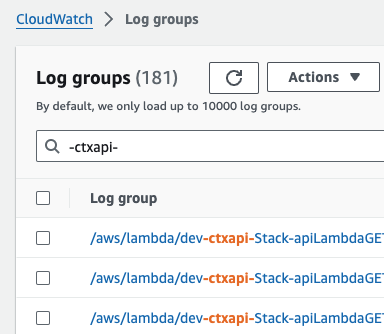
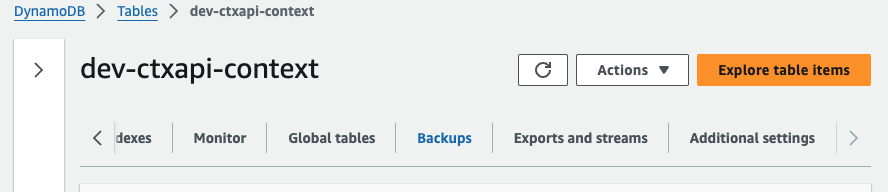

# ctxapi
api to support the context tool

## overview
This is the backend for the [ctx](https://github.com/charlesrobsampson/ctx) cli tool. The idea is that anyone can deploy this to their own aws account to then be able to use the tool. For personal usage, this should stay well within the free tier in aws unless you go absolutely bonkers with requests and don't follow the [billing tips](#billingTips) provided in the [setup](#setup). <a id="myNotPromise"></a>*I make no promises, but even if you blatanly ignore the [tips](#billingTips) and go nuts with requests, it should stay well under $5/month.*

## setup
First things first, you need to clone this repo

`git clone git@github.com:charlesrobsampson/ctxapi.git`

and setup your aws account and awscli. If you haven't already, you can follow [these instructions](https://docs.sst.dev/setting-up-aws). They should walk you through some best practices. Note that it will request billing info from you, but as long as you follow the [tips](#billingTips) in the docs, it should stay within the free tier. [See my not promise](#myNotPromise). You might want to also look at [this](https://docs.sst.dev/advanced/iam-credentials#loading-from-a-file) to help verify your awscli is setup correctly.

You will also need nodejs and npm installed. I would recommend having those recently updated.

Make sure to cd into the ctxapi directory after cloning. Then run:

`npm i`

Something to note here is that the aws region this is set to run in is `us-west-1` cuz that's close to me. You may want to choose a different region based on where you live. This can be changed in the [sst.config.ts](./sst.config.ts) file where it says `region: "us-west-1",` in the config near the top. Maybe one day I'll make this load from an env or something but I was lazy.

After this, I would try running this in the dev environment first by running:

`npm run dev`

You should see something like

```
npm run dev

> ctxapi@1.0.0 dev
> sst dev

Please enter a name you’d like to use for your personal stage. Or hit enter to use <whateverIsInYourAWSConfig>: 
```

Feel free to use `whateverIsInYourAWSConfig` if you want, I personally use `dev`

After you choose a name and hit ENTER, if everything works as it should, you will eventually see something that looks kinda like this

```
SST v2.40.3  ready!

➜  App:     ctxapi
   Stage:   dev
   Console: https://console.sst.dev/local/ctxapi/dev

|  Stack PUBLISH_ASSETS_COMPLETE 

✔  Deployed:
   Stack
   ApiEndpoint: https://someRandomString.execute-api.yourRegion.amazonaws.com
```

If it fails, you'll most likely have to debug that on your own. The [sst.dev](https://sst.dev/) site and communities are some great resources for help.

Once you get that passing you can test the [ctx](https://github.com/charlesrobsampson/ctx). If you haven't already installed that, go ahead and follow the [setup](https://github.com/charlesrobsampson/ctx?tab=readme-ov-file#setup) section.

When it is installed, try running a few commands with the aws dev url you saw printed earlier. For example:

```
CTX_HOST=https://someRandomString.execute-api.yourRegion.amazonaws.com \
CTX_USER=youGetToChooseHere \
ctx
```

If everything is setup and working correctly it should return

`no current context`

You could try switching to one and then running this again and it should return the context details:

```
CTX_HOST=https://someRandomString.execute-api.yourRegion.amazonaws.com \
CTX_USER=youGetToChooseHere \
ctx switch
```
This should give you a few promts to create a new context. When you finish creating the context you should see something similar to
```
updated context: test
with contextId: 2024-03-14T19:45:13Z
```
Reflecting the name and time this was created with

Once this is working you could run

```
CTX_HOST=https://someRandomString.execute-api.yourRegion.amazonaws.com \
CTX_USER=youGetToChooseHere \
ctx close
```
to close the context.

If you have made it here, great! You're almost ready to use the tool. The last step is to deploy this to production by running:

`npm run deploy-prod`

The output should eventually look similar to this
```
npm run deploy-prod   

> ctxapi@1.0.0 deploy-prod
> npx sst deploy --stage prod

SST v2.40.3

➜  App:     ctxapi
   Stage:   prod
   Region:  us-west-1
   Account: yourAwsAccountNumber

✔  Building...

|  Stack PUBLISH_ASSETS_COMPLETE 
⠋  Deploying...

✔  Deployed:
   Stack
   ApiEndpoint: https://aNewRandomString.execute-api.yourRegion.amazonaws.com
```
Take the new `ApiEndpoint` from the response and set it as the `CTX_HOST` environment variable for your shell like it mentions in the [ctx setup](https://github.com/charlesrobsampson/ctx?tab=readme-ov-file#setup).

`export CTX_HOST="https://aNewRandomString.execute-api.yourRegion.amazonaws.com"`

Now would be a good time to also set up the `CTX_USER` environment variable to avoid having to specify it each time you run the ctx commands:

`export CTX_USER="desiredUsername"`

Optionaly you can add an export type with `CTX_EXPORT_TYPE`. Currently only `yaml` and `json` are supported with `json` as the default.

`export CTX_EXPORT_TYPE="yaml"`

If everything ended up working as 🌞 and 🌈s then you should be good to run

`ctx`

to make sure it is working.

### security
You may have noticed that the only env vars necessary are the host and user. There's no private key or anything that secures the api. I thought about adding some security, and I may down the road... I was just lazy, but since the prod url is a randomly generated string, there's some security through obscurity. That being said, don't post your url anywhere. If you decide you really really want some security on this puppy, you could follow [this](https://sst.dev/examples/how-to-add-cognito-authentication-to-a-serverless-api.html) to get it added... if you do, hit me up and we can merge it in!

<a id="billingTips"></a>Now you will want to change a few settings in your aws config to avoid incurring charges.

### auto delete CloudWatch logs
- log in to the [aws console](https://console.aws.amazon.com/) with the credentials you created earlier
- make sure you are in the correct region (top right) mine is us-west-1, but make sure you select the one you deployed to
  - 
- use the search to go to CloudWatch
  - 
- once in CloudWatch, select `Logs -> Log groups` in the toolbar on the left
  - 
- Now search for `-ctxapi-` to find all log groups related to this project
  - 
- Select all the log groups that come up and click the `Actions` dropdown and select `Edit retention setting(s)`
  - 
- they will most likely all be at `Never expire`. That will definitely get you some charges so you want to change it so it'll eventually remove the logs. You can set it to whatever you like. I personally have mine set to 3 days
  - 
- Happy day! You will save some money!

### apply TTL to dynamo tables
- log in to the [aws console](https://console.aws.amazon.com/) with the credentials you created earlier
- make sure you are in the correct region (top right) mine is us-west-1, but make sure you select the one you deployed to
  - 
- use the search to go to DynamoDB
  - 
- select `Tables` on the left panel
  - 
- search `ctxapi` to get all tables for this project
  - 
- For each table turn on TTL. You will have to do these same steps for each one
  - select `Additional settings` from the toolbar, it will be on the far right and you may need to scroll
    - 
  - find the `Time to Live (TTL)` setting and turn it on
    - 
  - enter `expires` as the TTL attribute name
    - 
  - turn on TTL
    - 
- repeat for each table
- this will make it so it will automatically delete old context and queue items.
  - contexts are set to delete 1 year after completed or, if not completed, created.
  - queues are set to be deleted 3 months after they are started, or 1 year after they are added to queue if they are never started.
- Happy day! You will save some money!

## updating
As the api gets updated, simply pull the new changes and then deploy to prod again with

`npm run deploy-prod`

Once it has deployed again, you will probably want to go over the [billing tips](#billingTips) to double check you don't get charged if anything was added or changed.

